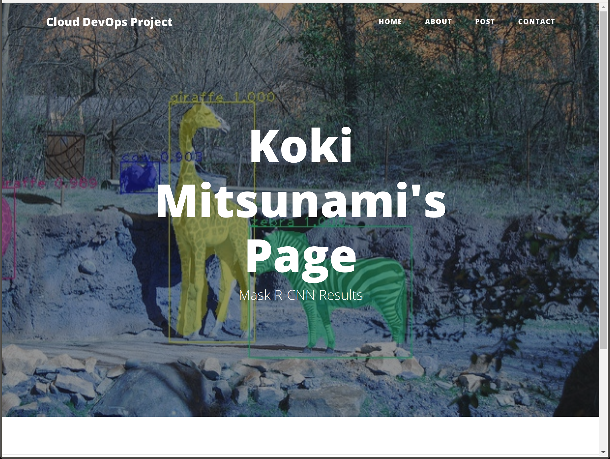

# CI-CD-Pipeline

## Project Overview

In this project, the CI/CD pipeline for micro services applications with rolling deployment. The application run Mask-RCNN on kubernetes clusters when you request. After executing the model, the application updates a background image of my website with the result image, and returns its labels.

* [Mask R-CNN](https://github.com/matterport/Mask_RCNN) is a Deep Learning model for object detection. The model generates bounding boxes and segmentation masks for each instance of an object in the image.

Website example:


Return value example:
```
{
    "labels": ", giraffe, zebra, giraffe, cow"
}
```

## Project Tasks

This project is using Jenkins to implement Countinuous Integration and Continuous Deployment.
The Jenkins pipeline include: 
    - Lint python scripts, HTML and Dockerfile
    - Build Docker image
    - Push the built Docker image to Docker repository

Deploying the Docker image should be run by executing scripts. For kubernetes cluster, AWS kubernetes as a Service is used with rolling update strategy. 

## How to Run Locally
To test locally, execute `./run_docker.sh` and `./make_prediction.sh` after that.

## Future Work
Currently, an image processed is selected randomly from a list upon a request, and generated HTML is not published automatically. Therefore, as next steps, processing any images and automatic publishing the website is preferable. The any image processing should be realized by sending a specific image by user. Also, it is possible to realize the automatic publish by adding launch of webserver easily.
